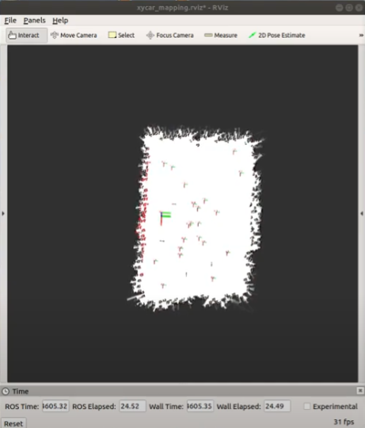
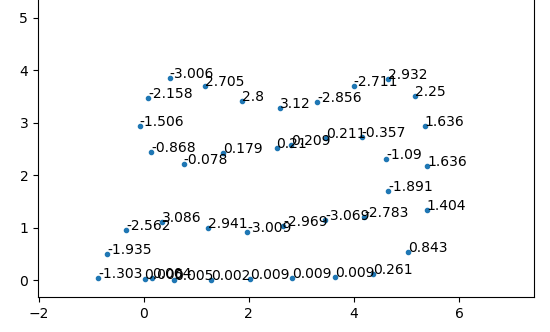

# Grepp - Xytron Auto-pilot Competition 2

## Final video

## Goal
* Auto-pilot driving only using lidar sensor

## Procedure

### Mapping & localization

* Used Cartographer in the simulation to mapping and localization
  

### Path planning & control
* Recorded ROS topic about car position from the simulation.
* Made pkl file for planning.
* Applied <u>Stanley control</u> to the car to follow the path.
  
(The values written in the plot is yaw of a car at a specific point.)

## Limitations
* Due to the limitation of the simulation, when the car steps to the speed bump lidar sensor gets nothing but a weird circle. So we had to re-localize our car.
* The only way to stop the car in the simulation was to make a car go backward. Which wasn't pleasing at all as an engineer's view.
* It was hard to find out where is the front data in the lidar sensor. Also it was hard to tell that lidar sensor was functioning well. So when we had to choose the lane and avoid the car, we chose to cross the lane.(It was kind of a cheating.)  

## What I've learned
* Got more familiar with the ROS.
* Got more familiar with the Stanley method.
* How SLAM works.

